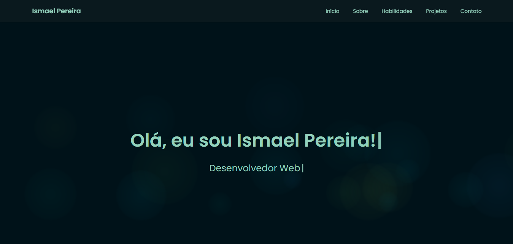

# 🚀 Portfólio Pessoal - Ismael Pereira

## 📌 Visão Geral

Bem-vindo ao meu portfólio profissional, uma vitrine digital que representa minha jornada como desenvolvedor web.



## 🏆 Status do Projeto

[](https://github.com/ismapereira/Portifolio-Ismael-Pereira)
[](https://github.com/ismapereira/Portifolio-Ismael-Pereira)
[](https://github.com/ismapereira)

## 🌟 Recursos Principais

- 💻 Design responsivo e moderno
- 🎨 Interface elegante e minimalista
- 📱 Totalmente adaptável a dispositivos móveis
- ⚡ Carregamento rápido e performance otimizada
- 🌈 Design consistente e acessível
- 🍔 Menu hambúrguer interativo
- 📧 Formulário de contato funcional com validação

## 🛠 Tecnologias e Bibliotecas

### Principais


### Bibliotecas e Serviços


## 🌐 Seções do Portfólio

- **Home**: Apresentação pessoal
- **Sobre**: Detalhes sobre minha trajetória
- **Habilidades**: Tecnologias e níveis de proficiência
- **Projetos**: Destaques dos meus trabalhos
- **Contato**: Formulário interativo com validação

## 🚀 Instalação e Uso

1. Clone o repositório
```bash
git clone https://github.com/ismapereira/Portifolio-Ismael-Pereira.git
```

2. Abra o arquivo `index.html` no seu navegador

## 🔄 Changelog

### [1.0.0] - Data da Primeira Versão
- Versão inicial do portfólio
- Implementação das seções: Home, Sobre, Habilidades, Projetos, Contato
- Adição de design responsivo
- Integração com EmailJS para formulário de contato

### [1.1.0] - Próxima Versão Planejada
- [ ] Adicionar animações de transição
- [ ] Melhorar otimização de performance
- [ ] Adicionar internacionalização

### [2024-02-03] - Melhorias na Página Inicial
- **Novo Recurso**: Adicionado efeito de bolhas dinâmicas na seção inicial
  - Bolhas flutuantes com gradientes suaves
  - Cores em tons de verde e azul
  - Animação orgânica e responsiva
  - Opacidade e desfoque personalizados
- Otimização do background da página inicial
- Melhoria na experiência visual e interatividade

### Detalhes Técnicos do Efeito de Bolhas
- **Tecnologias**: CSS Animation, JavaScript Dynamics
- **Características**:
  - Tamanho das bolhas: 50-200px
  - Opacidade: 0.3
  - Cores: Gradientes em verde e azul
  - Animação: Flutuação suave
  - Geração dinâmica com JavaScript

## 🚀 Próximas Implementações
- [ ] Adicionar modo escuro
- [ ] Implementar animações de scroll
- [ ] Criar seção de certificações

## 🤝 Guia de Contribuição

### Como Contribuir

1. **Faça um Fork do Repositório**
   - Clique no botão "Fork" no topo da página do GitHub

2. **Clone o Repositório**
   ```bash
   git clone https://github.seu-usuario/Portifolio-Ismael-Pereira.git
   cd Portifolio-Ismael-Pereira
   ```

3. **Crie uma Branch para sua Contribuição**
   ```bash
   git checkout -b feature/sua-feature
   ```

### Diretrizes de Contribuição

- Siga o estilo de código existente
- Adicione comentários explicativos quando necessário
- Teste completamente suas alterações antes de enviar um Pull Request
- Mantenha as alterações concisas e focadas

### Reportando Problemas

- Use a seção de Issues do GitHub
- Descreva detalhadamente o problema
- Inclua passos para reproduzir
- Mencione sua versão de navegador e sistema operacional

### Processo de Pull Request

1. Faça suas alterações
2. Commit com mensagens claras
3. Envie seu Pull Request
4. Aguarde revisão

**Nota**: Todas as contribuições são bem-vindas! 🌟

## 🔧 Personalização

- Altere informações pessoais em `index.html`
- Modifique estilos em `assets/css/styles.css`
- Ajuste comportamentos em `assets/js/main.js`

## 🤝 Contribuições

Contribuições, problemas e solicitações de recursos são bem-vindos! 
Sinta-se à vontade para verificar [página de issues](https://github.com/ismapereira/Portifolio-Ismael-Pereira/issues).

## 📱 Responsividade

O portfólio é totalmente responsivo, com suporte para:
- Desktops
- Tablets
- Smartphones

## 📧 Formulário de Contato

Recursos do formulário:
- Validação em tempo real
- Formatação automática de telefone
- Envio via EmailJS
- Feedback visual com SweetAlert2

### Validações
- Nome: Mínimo de 2 caracteres
- Email: Formato válido
- Telefone: 10-11 dígitos
- Mensagem: Mínimo de 10 caracteres

## 🌈 Tema e Design

- Paleta de cores moderna
- Tema verde-azulado
- Transições e animações suaves
- Acessibilidade considerada

## 📄 Licença

Este projeto está sob a licença MIT. Consulte o arquivo [LICENSE](LICENSE) para mais detalhes.

---

🌟 **Feito com ❤️ por Ismael Pereira**
